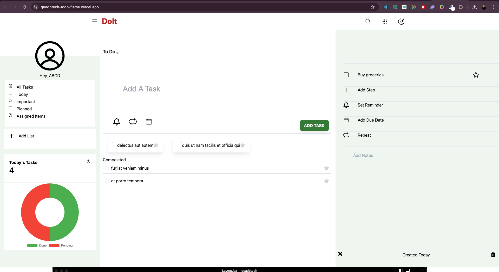
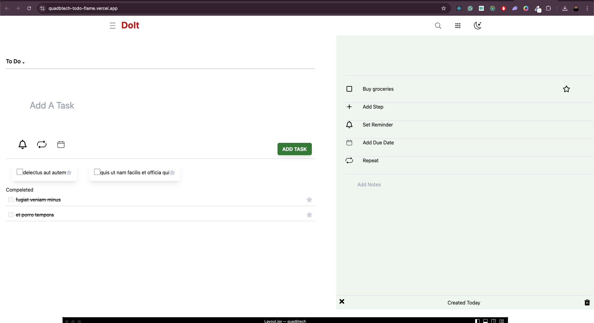
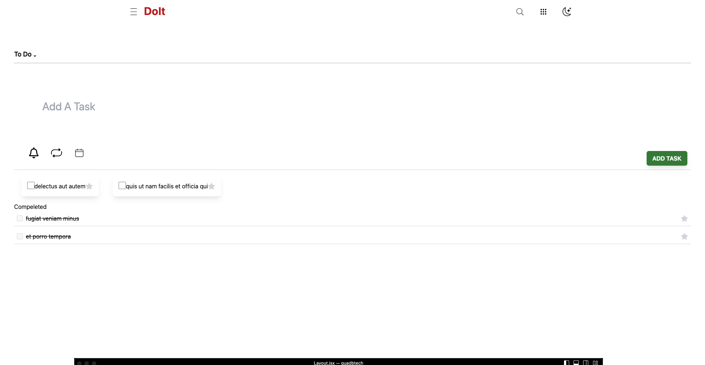
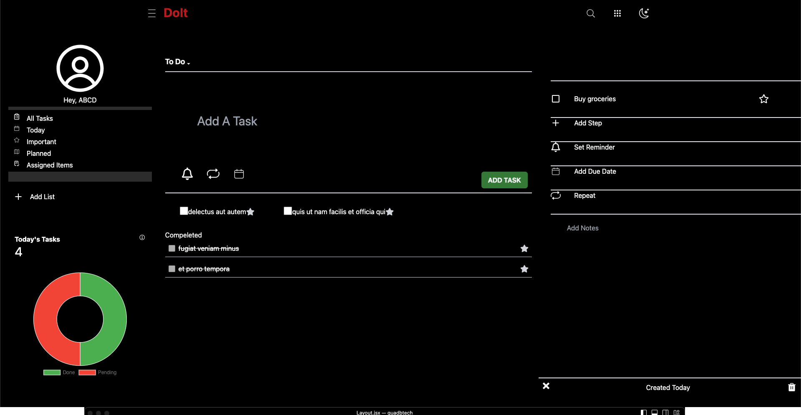

## QuadBtech

## Live Demo

Check out the live demo : (https://quadbtech-todo-flame.vercel.app/)

A simple and responsive Todo application built with React, Vite, Tailwind CSS, React Icons, and Redux Toolkit.

## Table of Contents

- [Features](#features)
- [Installation](#installation)
- [Available Scripts](#available-scripts)
- [Folder Structure](#folder-structure)
- [Technologies Used](#technologies-used)
- [Usage](#usage)
- [License](#license)

## Features

- Add, and delete tasks.
- Mark tasks as important or completed.
- Responsive design for mobile, tablet, and desktop.
- Dark mode support.

## Installation

To get started with this project, clone the repository and follow the installation steps below:

### 1. Clone the repository

```bash
git clone https://github.com/shadabBhai/quadbtech
cd react-todo-app


### 2. Installation dependencies

Use npm or yarn to install the required dependencies.
# Using npm
npm install

# Using yarn
yarn install

### 3. Start the development server
npm install

# Using yarn
yarn install

Available Scripts
In the project directory, you can run the following scripts:

npm run dev: Starts the development server.
npm run build: Builds the app for production.
npm run preview: Serves the built app locally for testing.
npm run lint: Runs ESLint to find and fix problems in your code


### Technologies Used
React: A JavaScript library for building user interfaces.
Vite: A fast build tool and development server for modern web projects.
Tailwind CSS: A utility-first CSS framework for rapid UI development.
React Icons: Popular icons as React components.
Redux: A predictable state container for JavaScript apps.
Redux Toolkit: The official, recommended way to write Redux logic.

## Screenshot  of th web app

```




